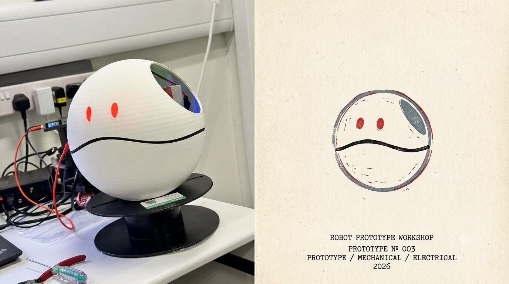

# Project Haro

## Robot Prototype



### Prototype Details

- **Prototype**: N° 003
- **Disciplines**: Mechanical / Electrical
- **Year**: 2026

## Current Progress

Project Haro is a robot prototype with the following implemented modules:

### Code Structure

```
project-haro/
├── main.py          # Entry point — manages tmux session for the robot
├── pyproject.toml   # Project config (uv) with dependencies
├── core/
│   ├── audio.py     # Audio server wrapper — plays sounds via simple-audio-server
│   └── indicator.py # Relay control — manages USB relay for hardware actuation
├── sounds/
│   ├── oh_hello.mp3 # Greeting sound
│   └── new_type.mp3 # New type / event sound
└── README.md
```

### Dependencies

| Package | Source | Purpose |
|---|---|---|
| `libtmux` | PyPI | Manages tmux sessions for the robot |
| `simple-audio-server` | GitHub | Audio playback server |
| `usb-relay-diustou` | GitHub | USB relay control for hardware |

### Status

- ✅ Project scaffolded with `uv`
- ✅ Audio module implemented
- ✅ Relay/indicator module implemented
- ✅ Sounds directory with sample audio
- 🔄 tmux session management in `main.py`
